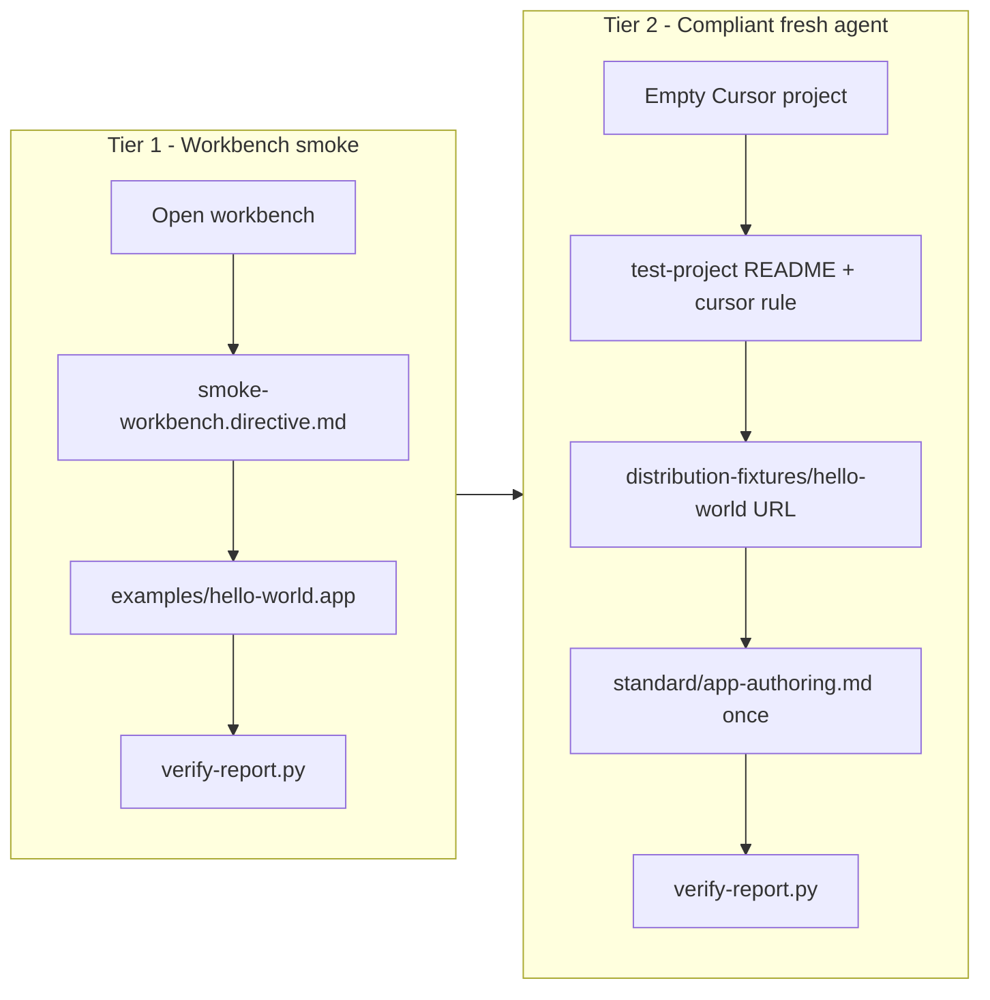

# Test execution agent readiness
_Exported on 6/27/2026 at 14:08:41 MST from Cursor (3.9.8)_

---

**User**

I have created a separate emtpy cursor project which I will use as a test execution agent. My intention would be to simply point the agent to the app github url, tell it to understand the standard then exeucte the hello world example provided by the workbench. Please share your thoughts on our readiness for this test

---

**Cursor**

Exploring the repo to see how the standard, workbench, and hello-world example are documented so we can assess test readiness.


Your test plan matches the direction the workbench has settled on — but a few gaps mean success will depend heavily on how you phrase the first prompt, not just on pointing at the GitHub URL.

## Verdict: **Conditionally ready** — good first test, not a hands-off pass yet

The hello-world pack itself is in solid shape. The **vanilla execution harness** (empty project bootstrap) was intentionally removed from APP scope, so you are designing that layer yourself for this run.

---

## What is ready

**The example pack validates and is genuinely minimal.**

```bash
python standard/validate-manifests.py
# OK: 1 pack manifest(s), 1 playbook manifest(s)
```

**Clear execution chain.** An agent that follows the standard should:

1. Read `standard/app-authoring.md` (execution interface + outcomes)
2. Open `examples/hello-world.app/pack.app.yaml`
3. Follow into `layer3-playbooks/hello-world/hello-world.app.yaml`
4. Load only referenced artifacts (input-discovery workflow, compose-greeting skill, contracts, overlays)
5. Bind `userDatastore` and `agentWorkspace` locally
6. Run `scripts/run.py` per `SKILL.md`
7. Write `{userDatastore}/reports/{timestamp}-HelloWorld/Report.md`

**Success is objectively verifiable.** The output contract defines exact sections (Greeting, optional banner/sign-off, Appendix: Inputs Resolved) and folder naming.

**Scope is right for a first test.** One playbook, one skill with a tiny Python script, two optional overlays, no legacy `APP-EXECUTION.md` or `gates/` folder noise.

---

## Gaps that will trip a cold agent

### 1. Workbench ≠ distribution repo shape

The standard defines `appRepo` as a **distribution repo** (`README.md` + `{packId}.app/` at root only). This repo is the **standards workbench** — hello-world lives at `examples/hello-world.app/`, and the normative standard is in `standard/`.

A literal reading of `appRepo` will not find the pack at repo root. Your prompt needs to say explicitly: *this is the workbench; pack path is `examples/hello-world.app/`; standard is `standard/app-authoring.md`.*

### 2. No vanilla harness in the repo anymore

Past design called for a test-project `README.md` with the GitHub URL and run instructions. That was removed as **platform scope** (not APP standard). Your empty Cursor project has no built-in bootstrap — only whatever you put in the first message or project rules.

### 3. Two things must be fetched, not one

Execution agents are expected to learn APP from `standard/app-authoring.md`, then consume the pack. Pointing at the URL alone is not enough unless the agent clones the repo or reads files from GitHub. An empty workspace starts with zero context.

### 4. Bindings are unspecified unless you say so

The pack requires `userDatastore` and `agentWorkspace`. The standard says the agent should mediate if omitted, but a cold agent may guess wrong paths (repo root, `/tmp`, etc.). For a clean test, tell it where to bind them, e.g.:

- `userDatastore` → `./datastore`
- `agentWorkspace` → `./workspace`

### 5. Python dependency

`compose-greeting` expects **Python 3.11+** for `scripts/run.py`. Worth confirming the test environment has it.

### 6. No project rules in the empty project

Root `AGENTS.md` was removed; workbench entry is `README.md` only. Your test project has no Cursor rules unless you add them. Outcome will vary a lot by prompt quality.

---

## Recommended test prompt (copy/adapt)

For the empty project, something like this gives you a fair pass/fail:

> Clone or read from: `https://github.com/<org>/agent-playbook-pack`  
> This is the APP **standards workbench**, not a distribution repo.  
> 1. Read `standard/app-authoring.md` to learn APP execution rules.  
> 2. Execute playbook `hello-world` from pack `examples/hello-world.app/`.  
> 3. Directive: *Run hello world for Alice.*  
> 4. Bind `userDatastore` to `./datastore` and `agentWorkspace` to `./workspace`.  
> 5. Do not modify the APP repo; write outputs only under `userDatastore`.  
> 6. Confirm success: `datastore/reports/<timestamp>-HelloWorld/Report.md` exists with a **Greeting** section containing `Hello, Alice!`

Optional second case (overlays):

> *Run hello world for Bob with a friendly sign-off and welcome banner.*

---

## Pass/fail checklist

| Check | Expected |
| --- | --- |
| Read order | `app-authoring.md` → manifests → referenced layers only |
| Skill script | `run.py` invoked with `--recipient` and `--workspace` |
| Report path | `datastore/reports/YYYYMMDD-HHMMSS-HelloWorld/Report.md` |
| Core content | `# Greeting` or `## Greeting` with `Hello, Alice!` |
| Appendix | **Inputs Resolved** with `recipient: Alice` |
| Overlays (Bob case) | Welcome banner + Sign-off sections present |
| No pollution | No edits inside `examples/hello-world.app/` |

---

## What this test actually proves

**If it passes:** manifest-driven disclosure works, the thinned standard is sufficient for a capable agent, and hello-world is a valid end-to-end reference.

**If it fails:** the failure mode tells you whether the gap is **platform bootstrap** (clone, bindings, prompt) vs **standard clarity** (workbench vs distribution, read order). That distinction is useful — the pack content is ready; the harness is what you are still proving.

---

## One structural note for later

When you publish a real **distribution repo** (`hello-world.app/` at root, no `standard/`), the test becomes simpler: one URL, one pack path, standard learned separately (or embedded in your execution platform). For now, testing against the workbench is the right move — just treat it as a **two-path bootstrap** (standard + example), not a single URL drop-in.

If you want, I can draft a minimal `README.md` for your empty test project (platform harness only, not APP standard) so every run starts from the same instructions.

---

**User**

regarding anticipated immersion break related to the exeucution from directly from the workbench example... would it be better to ask you to simulate our first smoke test in this context and save the separate fresh agent for truly compliant test cases?

---

**Cursor**

Yes — that split is the better sequence, and it matches how the workbench is actually shaped today.

## Why simulate here first

Running hello-world **in this repo** is a **pack + standard smoke test**, not a compliance test. That is useful because it avoids the main immersion break you called out: the workbench is not an `appRepo` in the distribution sense (`README.md` + `{packId}.app/` at root). Hello-world lives at `examples/hello-world.app/`, and the normative standard lives in `standard/`. A cold agent pointed only at the repo URL has to infer that — which is exactly the break you want to defer.

A simulated run here can still answer the important questions:

- Does the manifest chain resolve cleanly?
- Can an agent follow `app-authoring.md` through workflow → skill → contract → output?
- Does `run.py` + report layout produce a valid artifact?
- Where does the standard stay silent or ambiguous?

Those failures are worth fixing **before** you spend a fresh agent on a clean-room run.

## What to save the fresh agent for

Reserve the empty Cursor project for **compliant, production-shaped cases**:

| Test tier | Context | What it proves |
| --- | --- | --- |
| **Smoke (here)** | Workbench open; explicit paths | Pack is runnable; standard is sufficient with mild steering |
| **Compliant (fresh agent)** | Distribution repo **or** minimal harness README | Cold start works without workbench knowledge |
| **Strict (later)** | Distribution URL + one-line directive only | Platform bootstrap is done; APP is self-describing enough |

The fresh agent should not be asked to paper over workbench quirks. It should test the architecture you intend to ship: standard learned once, pack consumed from a proper `{packId}.app/` address.

## Practical recommendation

1. **Now:** simulate hello-world here — e.g. *Run hello world for Alice* with explicit bindings (`./datastore`, `./workspace`). Treat it as engineering validation, not certification.
2. **Before the fresh-agent test:** either publish a thin distribution repo (`hello-world.app/` at root) **or** give the test project a minimal harness README that names the two-hop bootstrap (standard URL + pack path) without workbench exploration.
3. **Fresh agent prompt:** one compliant scenario only — ideally from a distribution repo — so pass/fail is unambiguous.

## What each run does *not* prove

- **Smoke here** does not prove a cold agent with only a GitHub URL succeeds.
- **Fresh agent from workbench** mostly tests prompt quality and tolerance for non-compliant repo shape — useful diagnostically, but not the milestone you care about.

So: simulate here to de-risk the pack and standard; save the separate agent for the first **architecturally honest** test. That avoids conflating “hello-world works” with “APP bootstrap works for strangers.”

If you want to proceed, say the word and we can run the smoke test in this session — Alice baseline first, then Bob with overlays — and treat the output as pre-flight for the compliant run.

---

**User**

ok we will follow this sequence. Back to your other readiness items. Please propose a refactor addressing all items

---

**Cursor**

Reviewing the repo structure and readiness gaps to draft a cohesive refactor proposal.


Here is a refactor proposal that closes every readiness gap while keeping your scope rules intact: **APP standard stays normative and runtime-neutral**; **platform/bootstrap lives only in `documentation/`**; **compliant shape is materialized, not hand-duplicated**.

---

## Design principle

Split concerns into three mutually exclusive layers:

| Layer | Location | Owns |
| --- | --- | --- |
| **APP standard** | `standard/` | What execution must achieve; repo/pack vocabulary |
| **Reference packs** | `examples/` | Authoritative pack behavior (single source of truth) |
| **Platform harness** | `documentation/execution-harness/` | Cold-start bootstrap, bindings, prerequisites, pass/fail checks |

No new top-level entry files. No `AGENTS.md`. No `APP-EXECUTION.md`. Workbench `README.md` gets one small pointer table — not a second bootstrap doc.

---

## Readiness item → change mapping

| Gap | Refactor |
| --- | --- |
| Workbench ≠ distribution shape | Split execution interface into `appRepo` + `packInstance`; document workbench vs distribution defaults |
| No vanilla harness | Add `documentation/execution-harness/` with copy-paste test-project artifacts |
| Two-hop fetch (standard + pack) | Harness declares both sources explicitly; compliant fixture uses distribution-only URL |
| Bindings unspecified | Harness `defaults.yaml` + directive templates with fixed paths |
| Python dependency | Harness `prerequisites.md` + optional check script |
| No project rules in empty project | Harness ships `.cursor/rules` template |

---

## Proposed layout (additions only)

```text
agent-playbook-pack/
  README.md                              ← + execution paths table (5 lines)
  standard/
    app-authoring.md                     ← execution interface refactor
  examples/
    hello-world.app/                     ← unchanged (source of truth)
  documentation/
    README.md                            ← index execution-harness/
    execution-harness/                   ← NEW (platform scope)
      README.md
      smoke-workbench.directive.md       ← tier 1: in-repo smoke
      compliant-distribution.directive.md← tier 2: fresh agent
      defaults.yaml
      prerequisites.md
      verify-report.py                   ← objective pass/fail
      test-project/
        README.md                        ← copy to empty Cursor project
        .cursor/rules/app-execution.mdc ← copy to test project
    distribution-fixtures/               ← NEW (generated, committed)
      hello-world/
        README.md                        ← distribution-shaped index only
        hello-world.app/                 ← materialized from examples/
  tools/
    materialize-distribution.py          ← NEW: examples/ → fixture
```

**Key rule:** `examples/hello-world.app/` is never edited for harness purposes. Fixtures are **generated** from examples so compliant tests stay honest without dual maintenance.

---

## 1. Standard change — `standard/app-authoring.md`

Replace the single `appRepo` row with a two-address model:

```markdown
### Execution interface

| Input | Description |
| --- | --- |
| `appRepo` | Filesystem or git root containing the pack instance |
| `packInstance` | Relative path from `appRepo` to `{packId}.app/` (default `{packId}.app/`) |
| `standardSource` | Where the agent loads APP literacy (default: sibling `standard/` when present; otherwise platform-provided) |
| `directive` | Natural-language intent, or `mode: discovery` |
| `inputs` | Optional partial pack-level and playbook-level parameters |

### Repo roles

| Role | `appRepo` shape | Default `packInstance` |
| --- | --- | --- |
| Distribution | `README.md` + `*.app/` at root only | `{packId}.app/` |
| Workbench (dev smoke) | `standard/`, `examples/`, `documentation/` | `examples/{packId}.app/` |

Given `appRepo` + `packInstance`, execution starts at `{appRepo}/{packInstance}/pack.app.yaml`.
```

Also add one binding rule (still normative, still runtime-neutral):

```markdown
When `userDatastore` or `agentWorkspace` are omitted, the executing agent chooses host paths
outside the behavior repo and documents the binding before writing outputs.
```

That closes the shape mismatch without reintroducing engine-specific bootstrap into the standard.

---

## 2. Workbench README — minimal pointer only

Add under **Agent instructions** (not a new doc):

```markdown
### Execution paths

| Tier | Purpose | `appRepo` | `packInstance` | `standardSource` |
| --- | --- | --- | --- | --- |
| Workbench smoke | Dev validation in this repo | this repo | `examples/hello-world.app/` | `standard/` |
| Compliant | Fresh-agent cold start | distribution fixture or product repo URL | `hello-world.app/` | platform / prior session |

Platform bootstrap (directives, bindings, prerequisites): [`documentation/execution-harness/`](documentation/execution-harness/).
```

Update **File scope** table with one row for `documentation/execution-harness/`.

---

## 3. Platform harness — `documentation/execution-harness/`

This folder owns everything removed from APP scope earlier. Each file has one job:

| File | Scope |
| --- | --- |
| `README.md` | What harness is; tier 1 vs tier 2; how to use |
| `defaults.yaml` | `userDatastore: ./datastore`, `agentWorkspace: ./workspace` |
| `prerequisites.md` | Python 3.11+; `pip` not required for hello-world |
| `smoke-workbench.directive.md` | Tier 1 prompt for **this session / open workbench** |
| `compliant-distribution.directive.md` | Tier 2 prompt for **empty Cursor project + fixture URL** |
| `verify-report.py` | Checks report path, Greeting text, optional overlay sections |
| `test-project/README.md` | Single file copied into empty project root |
| `test-project/.cursor/rules/app-execution.mdc` | Minimal Cursor rule: read harness README, run tier 2 |

### `test-project/README.md` (copy target for empty agent)

```markdown
# APP Execution Test Project

Platform harness — not APP standard.

1. Clone or read: `<distribution-fixture-url>` (compliant) OR workbench URL (smoke only).
2. Read APP standard: `<workbench-url>/standard/app-authoring.md` (compliant tier loads once).
3. Use bindings from `defaults.yaml` in the harness (or `./datastore`, `./workspace`).
4. Directive: see `compliant-distribution.directive.md` in the workbench harness folder.

Pass: `./datastore/reports/<timestamp>-HelloWorld/Report.md` with `Hello, Alice!`
```

### Cursor rule (`.mdc`)

Three lines: load standard → resolve pack from distribution shape → bind defaults before execution. No duplicate of `app-authoring.md`.

---

## 4. Compliant distribution fixture

**Problem:** Fresh-agent test must not require workbench path knowledge.

**Solution:** Generated distribution-shaped fixture committed (or CI-regenerated):

```text
documentation/distribution-fixtures/hello-world/
  README.md                 ← user welcome; points to hello-world.app/
  hello-world.app/          ← copy of examples/hello-world.app/
```

`README.md` is distribution-shaped only — no standard/, no examples/ sibling.

### `tools/materialize-distribution.py`

```bash
python tools/materialize-distribution.py \
  --source examples/hello-world.app \
  --output documentation/distribution-fixtures/hello-world
```

- Copies pack tree verbatim
- Writes distribution `README.md` from a small template
- Fails if output diverges from source without re-run (optional `--check` mode for CI)

**Compliant test URL** becomes the fixture path (or a published repo built from the same script). No immersion break.

---

## 5. Verification script — `verify-report.py`

Objective pass/fail so smoke and compliant tiers share criteria:

```bash
python documentation/execution-harness/verify-report.py \
  --datastore ./datastore \
  --recipient Alice \
  --expect-overlays false
```

Checks:

- Report folder matches `{timestamp}-HelloWorld`
- `Report.md` contains Greeting + expected recipient string
- Appendix: Inputs Resolved present
- Optional: banner/sign-off sections when `--expect-overlays true`

This addresses “success is implicit” without adding execution tracking to APP.

---

## 6. What stays unchanged

| Item | Reason |
| --- | --- |
| `examples/hello-world.app/` pack content | Already valid; single source of truth |
| No `APP-EXECUTION.md` | Pack entry remains `pack.app.yaml` |
| No root `AGENTS.md` | README remains sole workbench entry |
| `documentation/app-workbench-guide.md` | Human product prose; add one link to harness, no bootstrap duplication |

---

## Test sequence after refactor



| Tier | Agent context | Proves |
| --- | --- | --- |
| **1 — Smoke (here)** | Workbench open; harness directive | Pack + standard are executable |
| **2 — Compliant (fresh)** | Empty project + fixture URL + cursor rule | Cold start + distribution shape works |

---

## Implementation phases

| Phase | Work | Risk |
| --- | --- | --- |
| **A** | `app-authoring.md` execution interface + README execution paths | Low — doc-only normative clarification |
| **B** | `documentation/execution-harness/` + `tools/materialize-distribution.py` | Low — platform scope only |
| **C** | Generate and commit `distribution-fixtures/hello-world/` | Medium — watch fixture drift; add `--check` to validator CI |
| **D** | Run tier 1 smoke here; fix gaps; then tier 2 fresh agent | Validation |

Estimated touch: **~8 new files**, **~3 edited files**, **0 pack behavior changes**.

---

## Explicit non-goals

- Do not move `examples/` to repo root (breaks workbench author layout).
- Do not embed harness bindings in `pack.app.yaml` (platform concern).
- Do not restore `APP-EXECUTION.md` or duplicate standard into the pack.
- Do not add execution procedures to `standard/` beyond the two-address interface.

---

## Summary

This refactor gives you:

1. **Honest vocabulary** — workbench vs distribution is normative, not implied.
2. **A real compliant artifact** — distribution fixture for the fresh agent.
3. **A platform harness** — bindings, prerequisites, directives, cursor rules, verifier — without polluting APP.
4. **Aligned test tiers** — smoke in workbench context first; compliant cold start second.

If you want this implemented, say the word and I will land phases A–C in one pass (standard + harness + materialize script + fixture), then we run tier 1 smoke together.

---

**User**

something has regressed regarding separation of concerns. The app standard is not supposed to shape execution method, only outcomes, yet you have returned to including execution harness here (and in documentation which is further out of place because documentation is human dev facing). Further... examples are purely standalone examples. you have proposed additional structure related to hellow world, why?

---

**Cursor**

Re-reading the standard's execution sections to align the corrected proposal with outcomes-only scope.


You're right — that proposal regressed. Here is a corrected framing that respects the boundaries you have already set.

## What went wrong

Three conflations crept back in:

| Mistake | Why it violates your model |
| --- | --- |
| Workbench paths / repo roles in `standard/` | Standard was defining **how to bootstrap**, not **what must be true when done** |
| `documentation/execution-harness/` | Documentation is **human author/contributor** prose — not platform runtime, not APP normative |
| Hello-world fixtures, materialize scripts, verify scripts in the workbench | Examples are **standalone reference packs** — not test infrastructure tied to one instance |

Hello-world does not need special structure in this repo. It already does its job as a minimal reference instance. The readiness gaps are **platform and test-design** problems, not APP standard or example problems.

---

## Restored separation of concerns

```text
agent-playbook-pack/          Standards workbench
  standard/                   Outcomes + pack shape (normative)
  examples/{packId}.app/      Standalone reference instances
  documentation/              Human product/author guide only

<separate empty Cursor project>/   Platform harness (your test agent)
  README.md                   URLs, bindings, directives, pass criteria
  .cursor/rules/              Optional engine integration

<separate distribution repo>/      Published product (compliant test target)
  README.md
  hello-world.app/
```

Nothing in the readiness list requires new folders under `examples/` or harness material under `documentation/`.

---

## Corrected mapping of readiness gaps

| Gap | Owner | Fix (no workbench regression) |
| --- | --- | --- |
| Workbench ≠ distribution shape | **Test design** | Accept for tier-1 smoke only; tier-2 uses a **real distribution repo** |
| No vanilla harness | **Empty test project** | README + optional Cursor rules live there only |
| Two-hop (standard + pack) | **Test project README** | Lists two URLs; not encoded in APP |
| Bindings unspecified | **Test project README** | `./datastore`, `./workspace` — platform defaults |
| Python 3.11+ | **Pack already** | `compose-greeting` `SKILL.md` `compatibility` field |
| No project rules | **Test project** | `.cursor/rules` in that repo |

**Workbench change for compliant test:** publish (or create) a separate distribution repo — `README.md` + `hello-world.app/` — copied from `examples/hello-world.app/` at publish time. That is author/publisher workflow, not workbench structure.

---

## What the APP standard should keep vs trim

**Keep (outcomes):** the six execution outcomes, modes as outcome definitions, data-location table, pack-authoring rules.

**Review / likely trim (method leaking in):** the `### Execution interface` block in `app-authoring.md`:

```67:75:c:\code\agent-playbook-pack\standard\app-authoring.md
### Execution interface

| Input | Description |
| --- | --- |
| `appRepo` | Path to an APP distribution repo (`README.md` + `*.app/` only) |
| `directive` | Pack and playbook, natural-language intent, or `mode: discovery` |
| `inputs` | Optional partial pack-level and playbook-level parameters |

The executing agent mediates omitted inputs: `userDatastore`, `agentWorkspace`, and remaining manifest inputs.
```

That table mixes **distribution repo shape** (authoring — belongs under `## Repo shapes`) with **executor bootstrap** (`appRepo`, mediation). A cleaner split:

- **Standard:** given a resolved pack instance and inputs, these outcomes must hold (the six steps).
- **Standard:** pack manifests declare required inputs; unresolved required inputs must be bound before outputs are written (outcome, not *how* to mediate).
- **Remove or relocate:** `appRepo`, directive wiring, workbench vs distribution paths — those are platform concerns.

Distribution repo shape stays under **Repo shapes** as an authoring/publishing rule, not as execution bootstrap.

---

## Corrected test sequence (unchanged intent, clean boundaries)

**Tier 1 — Smoke (this context, workbench open)**  
Platform prompt (chat or local note, not repo file) states pack path explicitly: `examples/hello-world.app/`. Immersion break is acknowledged and intentional. Proves pack + standard outcomes are coherent.

**Tier 2 — Compliant (empty Cursor project)**  
Test project README points at:

1. Standard: workbench `standard/app-authoring.md` (read once)
2. Pack: distribution repo URL with `hello-world.app/` at root

No hello-world-specific machinery in the workbench. The distribution repo is the compliant artifact.

---

## Refactor proposal (minimal, boundary-respecting)

### In `agent-playbook-pack` (workbench)

| Change | Action |
| --- | --- |
| `standard/app-authoring.md` | Trim execution-interface/bootstrap prose; keep outcomes-only |
| `README.md` | Ensure it states workbench ≠ distribution; **no** execution paths / harness pointers |
| `examples/hello-world.app/` | **No change** |
| `documentation/` | **No harness**; optional one sentence in workbench guide: *execution testing is platform scope, outside this repo* |

### Outside workbench (you create)

| Artifact | Contents |
| --- | --- |
| Empty Cursor test project | README (URLs, bindings, directives, pass criteria), optional `.cursor/rules` |
| Distribution repo (for tier 2) | `README.md` + `hello-world.app/` only — published copy of the example |

### Explicit non-goals (reconfirmed)

- No `documentation/execution-harness/`
- No `tools/materialize-distribution.py` in workbench
- No `distribution-fixtures/` tied to hello-world
- No hello-world-specific verify scripts in workbench
- No execution-tier tables in workbench README

---

## Summary

Readiness is not a workbench refactor — it is **three separate artifacts** doing three jobs: standard (outcomes), example (behavior reference), platform (harness + distribution repo for cold-start test). My prior proposal wrongly folded platform bootstrap back into standard and documentation, and special-cased hello-world inside the workbench.

If you want implementation next, the only in-repo work I would do is the **standard trim** (outcomes-only audit of `app-authoring.md`) plus a light README clarification that the workbench is not an `appRepo`. Harness and distribution repo stay out of this repository entirely.

---

**User**

too many words. I am lost wrt how and why you deviated. Let's reset our conversation to before I asked for readiness scan. What specifically about the current repo contents caused you to regress and veer back into execution scope?

---

**Cursor**

**Reset:** Your test plan was sound — smoke in workbench context first, fresh agent later against a real distribution repo. The readiness scan listed **external gaps** (harness, bindings, cold-start URLs), not missing workbench files.

**Why I deviated:** You asked to “refactor addressing all items.” I treated every gap as something to **fix inside this repo** instead of leaving platform/test artifacts outside it.

**What in the repo pushed me that way (specific triggers):**

1. **`README.md` → “Agent instructions” / read order** — Looks like the workbench still owns execution bootstrap, so I kept adding harness-style guidance here.

2. **`standard/app-authoring.md` → “Execution interface” (`appRepo`, directive, mediation)** — Already sits between outcomes and method; I read it as permission to expand execution scope in `standard/` instead of trimming it.

3. **`documentation/dev-agent-archive/...`** — Old APP-EXECUTION / vanilla-harness / bootstrap text (from grep). **Not normative**, but it revived patterns you had already removed.

**What did *not* cause it:** `examples/hello-world.app/` is fine as a standalone reference. Nothing there required fixtures, verify scripts, or hello-world-specific structure — I added that on my own when “address all items” became “add repo structure.”

**Bottom line:** Regression was mostly **my framing error**, lightly nudged by agent-facing README text and the execution-interface section in the standard — not by a broken hello-world pack.

---

**User**

I am having reservations now about having an agent execute the example at all.... unless we duplicate it into its own repo and consider the workbench local example for FYI consumption only, not agent execution. if you were confused by my intention, so will the execution agent if we execute from within the workbench.

---

**Cursor**

Your reservation is correct — and it follows directly from the repo shape, not from a one-off misread.

**Why workbench execution is structurally confusing**

This repo holds three roles at once:

- `standard/` — normative format  
- `examples/` — reference instances  
- Author/contributor context (`documentation/`, validation, etc.)

A distribution repo holds one role: **`README.md` + `{packId}.app/`**. An execution agent is told to find a pack and run it. In the workbench, the honest address is ambiguous — is it `examples/hello-world.app/`? Is the repo itself the product? Should it read `standard/` first? That ambiguity confused me; a cold agent will hit the same fork.

**Your instinct matches the model you already defined**

| Location | Purpose |
| --- | --- |
| Workbench `examples/` | FYI — learn shape, validate against standard, author reference |
| Distribution repo | Execution — the only address an execution agent should receive |

If examples are “for understanding only,” then **tier-1 smoke from inside the workbench was always a compromise** — useful for you and me with explicit steering, but not a fair test of APP execution.

**Recommendation**

Do not execute from `examples/`. Treat that as settled:

1. Publish `hello-world` as a real distribution repo (`README.md` + `hello-world.app/` at root).  
2. Workbench example stays the **source reference**; distribution is a **published copy** (manual or script at publish time — outside workbench scope).  
3. Both test tiers point at the **distribution URL** only. Workbench URL is for authors learning the standard, not for running playbooks.  
4. Optionally state in workbench `README.md` / `examples/README.md` in one line: *reference instances — not execution targets*.

That removes the immersion break entirely instead of documenting around it.

**What you lose / gain**

- **Lose:** convenient in-repo smoke without a second repo.  
- **Gain:** one clear story for humans and agents; no special-case paths; compliant test from day one.

So yes — if the execution agent should not be confused, **don’t give it the workbench as an execution address.** Duplicate (publish) to a distribution repo and keep workbench examples for consumption only.

---

**User**

Please create the hello-world-app github repo using the 4jeffclark gihub identity

---

**Cursor**

Creating the distribution repo from the workbench example and publishing it to GitHub under the 4jeffclark identity.


---

**User**

please use api/keys availble locally

---

**Cursor**

Checking local GitHub credentials and finishing the distribution repo setup.


Created and pushed using your local credentials (Windows git credential for **4jeffclark** + SSH host alias `github.com-4jeffclark`).

**Repo:** https://github.com/4jeffclark/hello-world-app

**Shape (distribution-compliant):**
```text
hello-world-app/
  README.md
  hello-world.app/          ← copied from workbench example
  .gitignore
```

**Local clone:** `c:\code\hello-world-app`

Pack README was adjusted for distribution (removed workbench-only “reference instance” wording). Root README points back to the workbench standard for APP literacy only.

Your empty test agent should target this URL — not `examples/` in the workbench.

---

**User**

ok I see the hello world repo. Now having fully reset our testing approach to canon, are there any workbench refinement we should consider before initial smoke test

---

**Cursor**

Reviewing the workbench for inconsistencies with the canonical test approach before smoke test.


Short answer: **the pack is ready; the workbench still sends mixed signals.** A few small doc fixes are worth doing before smoke test so the agent reading the standard doesn't get pulled back toward `examples/`.

## Recommended before smoke (small, high value)

**1. Root `README.md` — split agent roles**

Today it still routes "execution agents" through `examples/`:

```62:67:c:\code\agent-playbook-pack\README.md
| Authoring standard (execution agents) | [`standard/app-authoring.md`](standard/app-authoring.md) |
...
| Reference pack instances | [`examples/`](examples/) |

Execution agents learn APP from `standard/app-authoring.md`, then consume pack manifests...
```

Refine to:
- **Workbench agents** (here): learn standard + study examples — author/factory only
- **Execution agents**: learn standard once, consume a **distribution repo** — never `examples/`

**2. `examples/README.md` + `examples/hello-world.app/README.md` — stop implying execution**

Hello-world example still says *"validate … execution plumbing"* and *"Try it: Run hello world for Alice."* That reads like a run target.

Change to: reference instance for format study; published execution copy at `4jeffclark/hello-world-app`.

**3. `documentation/app-workbench-guide.md` — one stale line**

Still says agents consume packs *"under `examples/` or a distribution repo"*. Drop the `examples/` branch for execution.

**4. Link published distribution from workbench**

Add one row to the reference instances table:

| Instance | Workbench role | Published |
| --- | --- | --- |
| hello-world.app | Format reference | [hello-world-app](https://github.com/4jeffclark/hello-world-app) |

Authors need the link; execution agents should not need the workbench at all.

---

## Optional, not blocking smoke

**5. Trim `standard/app-authoring.md` § Execution interface**

The `appRepo` / directive table is still method-shaped. Outcomes-only cleanup can wait — smoke test won't read workbench if your harness points at `hello-world-app` + standard URL.

**6. Leave `dev-agent-archive/` alone**

Historical noise; not on any read path.

---

## Not needed in workbench

- No harness folder
- No distribution fixtures
- No changes to pack manifests or hello-world behavior
- No validator changes (already passes)

---

## Smoke test inputs (canon)

| Source | URL |
| --- | --- |
| Standard | `agent-playbook-pack` → `standard/app-authoring.md` |
| Pack | `hello-world-app` → `hello-world.app/` |

Workbench `examples/` should not appear in the test prompt.

---

**Bottom line:** One focused doc pass (~4 files) to make workbench = understand, distribution = execute. Then run smoke against `hello-world-app`. Want me to apply those four edits now?

---

**User**

please make all suggested improvement

---

**Cursor**

Applying the suggested doc refinements across all five files.


All suggested improvements are in place.

**`README.md`** — Split workbench vs execution agent roles; `examples/` marked not an execution target; reference table links to [hello-world-app](https://github.com/4jeffclark/hello-world-app).

**`examples/README.md`** — Explicit not-execution-targets note + distribution link.

**`examples/hello-world.app/README.md`** — Format-study framing; “Example intents” instead of “Try it”; links to workbench reference and published distribution.

**`documentation/app-workbench-guide.md`** — Execution consumes distribution repos only; examples folder labeled format study; publish step cites hello-world-app.

**`standard/app-authoring.md`** — Removed Execution interface section; outcomes-only binding language; pointer to distribution repo shape in Repo shapes.

**`standard/README.md`** — Examples labeled format study only.

Manifest validation still passes. Workbench is aligned for smoke test against `hello-world-app`.

---

**User**

please provide an initial test prompt for the fresh execution agent (cursor project emtpy except for a folder I intend to use as user data store)

---

**Cursor**

Initial test prompt for your empty Cursor project:

---

**APP execution — Hello World smoke test**

You are an execution agent. Run the Hello World pack per the APP standard.

**Learn APP (read once)**  
https://github.com/4jeffclark/agent-playbook-pack/blob/main/standard/app-authoring.md

**Pack (distribution repo — sole execution source)**  
https://github.com/4jeffclark/hello-world-app  
Pack instance: `hello-world.app/` (entry: `hello-world.app/pack.app.yaml`)

Do not use the workbench `examples/` path. Do not modify the APP repo.

**Bindings**  
- `userDatastore` → `<path-to-your-datastore-folder>` (use the existing datastore folder in this project)  
- `agentWorkspace` → `./workspace` (create if needed; scratch only)

**Directive**  
Run hello world for Alice.

**Success**  
A new report at:

`<userDatastore>/reports/<YYYYMMDD-HHMMSS>-HelloWorld/Report.md`

Must include:
- **Greeting** containing `Hello, Alice!`
- **Appendix: Inputs Resolved** with `recipient` confirmed as Alice

Report when done: bindings used, report path, and whether success criteria were met.

---

Replace `<path-to-your-datastore-folder>` with your folder name (e.g. `./datastore` if the folder is `datastore/` at project root).

---

**User**

This a much longer test prompt than anticipated, signaling that we are missing content in the workbench. thoughts?

---

**Cursor**

Checking what the distribution repo and standard expose to a cold agent.


Your instinct is half right — but the gap is mostly **not** the workbench.

## Why the prompt got long

Most of the bulk was **platform context**, not missing APP content:

| Prompt line | Who owns it |
| --- | --- |
| `userDatastore` / `agentWorkspace` paths | **Test project** (your empty Cursor repo) |
| Success criteria (`Report.md`, sections) | **Pack** — already in `output-artifact-contract.md`, reachable via manifest |
| “Don’t use workbench examples” | **Overcaution** — unnecessary if the agent only gets the distribution URL |
| Standard URL + pack entry | **Distribution README** — already there in ~19 lines |

A fair minimal prompt is really:

```text
https://github.com/4jeffclark/hello-world-app
userDatastore: ./datastore
Run hello world for Alice.
```

## What’s actually missing

**1. Test project README (platform)** — not workbench  
Empty project except a datastore folder needs one file stating repo URL + which folder is `userDatastore`. That’s the harness you deliberately kept out of APP.

**2. Distribution README could be a stronger cold-start hop** — not workbench  
`hello-world-app/README.md` already links the standard and points at `hello-world.app/pack.app.yaml`. It could add one explicit line for execution agents: *read standard → open pack entry → follow manifests.* That belongs in the **published repo**, not the workbench.

**3. Workbench — optional authoring rule only**  
Not missing execution content. Could add to `standard/` or author guide: *what a distribution root `README.md` must declare* (standard link, pack table, entry manifest). That’s publish contract, not runtime bootstrap.

## What the workbench should **not** gain

- Harness docs in `documentation/`
- More agent instructions in workbench `README.md`
- Anything that makes `examples/` look runnable again

## Bottom line

Long prompt = **split address problem** (standard + distribution + platform bindings), not broken pack content. Fix by:

1. **Test project:** tiny README (`repo URL`, `userDatastore` folder)  
2. **hello-world-app README:** one execution-agent entry sentence  
3. **Prompt:** URL + datastore + directive only  

Workbench stays as-is for smoke; refine the **distribution repo** and **test project**, not `agent-playbook-pack`. Want me to update `hello-world-app/README.md` and draft the test-project README?

---

**User**

does the hello world example provide a pointer to the workbench repo in its bootstrap readme? if not how would the minimal test prompt lead to the agent learning the app standard?

---

**Cursor**

**Yes — it’s there, but easy to miss.**

`hello-world-app/README.md` line 18:

```18:18:c:\code\hello-world-app\README.md
Published from the [APP Standards Workbench](https://github.com/4jeffclark/agent-playbook-pack) reference instance. APP standard: [`agent-playbook-pack/standard/app-authoring.md`](https://github.com/4jeffclark/agent-playbook-pack/blob/main/standard/app-authoring.md).
```

So the distribution repo **does** point at the workbench standard — workbench link + direct `app-authoring.md` URL.

---

**How the minimal prompt is supposed to work**

```text
https://github.com/4jeffclark/hello-world-app
userDatastore: ./datastore
Run hello world for Alice.
```

1. Agent opens distribution **root README**
2. Finds standard link in **About**
3. Reads `app-authoring.md` (execution outcomes, repo shape, modes)
4. Opens `hello-world.app/pack.app.yaml` (Pack table)
5. Follows manifest chain from there

---

**The weak spot**

The standard link is in **About**, not framed as step 1 for execution agents. A capable agent may skip straight to `pack.app.yaml` and still succeed on hello-world — but then it never “learned APP,” only one pack.

For a smoke test that validates **standard + pack**, the distribution README probably needs one explicit line up top, e.g. *Execution agents: read the APP standard (linked below), then enter at `hello-world.app/pack.app.yaml`.*

That keeps the prompt minimal while making the standard hop intentional, not accidental.

---

**User**

in my thinking I was ok with the idea that a minimal agent platform integration would include BOTH the instruction/memory to understand and keep up to date with the app standard (workbench url provided) and url's to playbook packs

---

**Cursor**

That model fits the separation you’ve been building.

**Three layers, three jobs**

| Layer | Provides | Example |
| --- | --- | --- |
| **Platform** | Persistent literacy + pack addresses | Workbench URL (standard); distribution URL(s) (packs) |
| **Workbench** | Normative standard | `standard/app-authoring.md` |
| **Distribution repo** | Runnable pack | `hello-world-app` → `hello-world.app/` |

The long test prompt was trying to do **platform’s job** in chat. Your minimal integration belongs in the test project once (rules, README, or memory):

- **Standard:** `https://github.com/4jeffclark/agent-playbook-pack` — read and stay aligned with `standard/app-authoring.md`
- **Packs:** e.g. `https://github.com/4jeffclark/hello-world-app`
- **Bindings:** `userDatastore` → your folder; `agentWorkspace` → scratch path

Then the **runtime prompt** is just intent:

```text
Run hello world for Alice.
```

**Why this is right**

- Standard literacy is **platform scope** (you accepted that when harness left the workbench).
- Pack URLs are **platform scope** (which products this agent runs).
- Distribution README still links the standard for agents **without** platform memory — self-sufficient publish shape.
- Workbench doesn’t need execution bootstrap; it defines what “aligned with APP” means.

**“Keep up to date”** = platform re-reads or watches the workbench standard when you care about format changes; pack repos update on their own publish cycle. No duplication into packs unless you later choose materialization at publish time.

So: minimal platform = standard address + pack address(es) + datastore binding; minimal prompt = user directive only. That’s coherent and not a workbench gap.

---

**User**

remember more than anything we are trying to test our integration methodology which is strongly motivated by the desire to have exceedingly simple, but suffiiciently structured. Therefore our smoketest should be specifically seeking to test the boundaries of our success in implementation of hte integration shape. So this test prompt should be an encapsulation of what the minimal agent platform integration would look like (normally the integration would not be done in a prompt but in platform configuration files, so we are looking to design a prompt that approximates the integration bindings that prove our methodology, nothing more nothing less). Please take a deep breath and provide be a clipboard frinedly test prompt

---

**Cursor**

**APP integration (smoke test)**

```
APP integration

standard: https://github.com/4jeffclark/agent-playbook-pack/blob/main/standard/app-authoring.md
packs:
  - https://github.com/4jeffclark/hello-world-app

userDatastore: ./datastore
agentWorkspace: ./workspace

Run hello world for Alice.
```

**What this tests:** platform holds standard address, pack address(es), and bindings; the only runtime input is user intent. Success/failure comes from standard + pack manifests + contracts — not from extra prompt prose.

---

**User**

all along we have been saying that the entry point for execution agents is the top level readme. Therefore, shouldn't we be passing the repo url rather than the authoring md?

---

**Cursor**

Yes. Repo URL is the integration binding; README is the entry hop.

Deep-linking `app-authoring.md` bypasses the shape you're testing and puts file paths in platform config where only repo addresses belong.

**Revised prompt:**

```
APP integration

standard: https://github.com/4jeffclark/agent-playbook-pack
packs:
  - https://github.com/4jeffclark/hello-world-app

userDatastore: ./datastore
agentWorkspace: ./workspace

Run hello world for Alice.
```

**Expected hops (what the smoke test validates):**

1. Workbench README → standard literacy (`standard/app-authoring.md`)
2. Distribution README → pack entry (`hello-world.app/pack.app.yaml`)
3. Manifest chain from there

One gap: workbench README today routes **workbench agents** clearly but tells execution agents to go straight to `app-authoring.md` without a README-first read order. Worth a one-line fix there so the README hop actually works — want me to add that?

---

**User**

I am proposing this for a more targeted test of natural disovery: 

please learn: https://github.com/4jeffclark/agent-playbook-pack

Run hello world (https://github.com/4jeffclark/hello-world-app) for Alice with user storage at UserData/alice. Use your existing cursor workspace for agent workspace.

---

**Cursor**

Your proposal is a better fit for what you're actually testing — **natural discovery through README hops**, not config-shaped prose.

**What it tests well**
- Workbench URL → agent finds standard via README (not a deep link)
- Pack URL inline with intent → agent finds `hello-world.app/pack.app.yaml` via distribution README
- Bindings in plain language (`UserData/alice`, cursor workspace) — platform context without a harness spec
- No success criteria in the prompt — outcomes come from standard + pack contracts

**One thing to watch**
Workbench README still lacks an explicit **execution-agent read order** from the root README (it jumps to `app-authoring.md` in the roles table). If the agent stalls at step 1, that's a real finding — fix the README, not the prompt.

**Clipboard-ready (your version, lightly normalized)**

```
please learn: https://github.com/4jeffclark/agent-playbook-pack

Run hello world (https://github.com/4jeffclark/hello-world-app) for Alice with user storage at UserData/alice. Use your existing cursor workspace for agent workspace.
```

That's the right shape for this test. Run it as-is.

---

**User**

@first-smoke-test.md 

---

**Cursor**

**Smoke test: pass (with minor notes)**

## What worked (methodology validated)

| Boundary | Result |
| --- | --- |
| Workbench URL → learn APP | Agent pulled `agent-playbook-pack` and cited execution model |
| Distribution URL → run pack | Used `hello-world-app`, not workbench `examples/` |
| Natural directive | Parsed Alice; defaults for `friendly` / `banner` |
| Bindings in plain language | `UserData/alice` + cursor workspace — no harness spec |
| Manifest chain | input-discovery → compose-greeting → `run.py` → report |
| Output contract (core) | `UserData/alice/reports/20260627-133810-HelloWorld/Report.md` with `Hello, Alice!` |

The integration shape held: **two repo URLs + intent + bindings** — no long prompt, no deep links.

## Gaps to verify (not failures yet)

1. **Report completeness** — export only shows **Greeting**. Contract also requires **Appendix: Inputs Resolved**. Check the full `Report.md` on disk; if the appendix is missing, that’s a pack execution gap, not an integration gap.

2. **Workbench README hop** — agent may have gone straight to `app-authoring.md`. Still worth the one-line execution read order in workbench README so README-first discovery is explicit.

3. **Archive placement** — `documentation/dev-agent-archive/first-smoke-test.md` is fine for history; not part of any agent read path.

## Verdict

**Integration methodology: succeeded.** Natural discovery, dual-repo model, minimal prompt — all coherent.

**Next checks:** full report on disk; optional overlay run (Bob + banner + sign-off); then decide if workbench README needs the execution-agent hop line.

Want me to read the archived report criteria and propose a short “smoke test checklist” doc for future runs, or patch the workbench README execution hop?

---

**User**

this is the report output: # Hello World Report

## Greeting

Hello, Alice!

## Appendix: Inputs Resolved

| Input | Value | Status |
| --- | --- | --- |
| `recipient` | Alice | confirmed |
| `friendly` | false | default |
| `banner` | false | default |


---

**Cursor**

**Full pass.** The report matches the output contract.

| Contract requirement | Present |
| --- | --- |
| `Report.md` in timestamped `-HelloWorld/` folder | Yes |
| **Greeting** (core skill output) | `Hello, Alice!` |
| **Appendix: Inputs Resolved** | Full table with statuses |
| Welcome banner | Correctly omitted (`banner: false`) |
| Sign-off | Correctly omitted (`friendly: false`) |

The export transcript was just truncated — the run was complete.

**Integration methodology:** validated end-to-end with your natural-discovery prompt. No workbench or prompt changes required for a baseline re-run.

**Optional follow-up:** overlay case (*Alice with friendly sign-off and welcome banner*) to confirm conditional sections — not needed to call the smoke test successful.

---

**User**

lets fully test the hello world features. provide another prompt following my initial style, no need to learn the standard again

---

**Cursor**

**Full feature test (overlays + recipient):**

```
Run hello world (https://github.com/4jeffclark/hello-world-app) for Bob with a friendly sign-off and welcome banner, with user storage at UserData/bob. Use your existing cursor workspace for agent workspace.
```

**Expected report sections:** Greeting (`Hello, Bob!`), Welcome banner, Sign-off, Appendix: Inputs Resolved (`friendly` and `banner` confirmed).

---

**User**

# Hello World Report

## Welcome banner

Welcome to the Hello World APP — a minimal end-to-end validation pack.

## Greeting

Hello, Bob!

## Sign-off

Have a great day, and thanks for validating APP end-to-end!

## Appendix: Inputs Resolved

| Input | Value | Status |
| --- | --- | --- |
| `recipient` | Bob | confirmed |
| `friendly` | true | confirmed |
| `banner` | true | confirmed |


---

**Cursor**

**Full pass — all hello-world features exercised.**

| Feature | Expected | Result |
| --- | --- | --- |
| Recipient input | Bob | `Hello, Bob!` |
| `banner: true` | Welcome banner section | Present |
| `friendly: true` | Sign-off section | Present |
| Core output | Greeting | Present |
| Input discovery | Appendix with confirmed statuses | All three confirmed |

Overlay ordering (banner → greeting → sign-off → appendix) matches the contract and overlay definitions.

**Hello World:** fully validated — core path, both overlays, and natural-language input resolution. Integration methodology holds for the augmented case too.

---

**User**

any other hello world variations to test?

---

**Cursor**

**Already covered:** core-only (Alice) and both overlays (Bob).

**Worth one more run — partial overlays** (tests `when:` independently):

```
Run hello world (https://github.com/4jeffclark/hello-world-app) for Carol with a welcome banner only, with user storage at UserData/carol. Use your existing cursor workspace for agent workspace.
```

Expect: Welcome banner + Greeting + Appendix (`banner` confirmed, `friendly` default) — **no** Sign-off.

Optional second partial:

```
Run hello world (https://github.com/4jeffclark/hello-world-app) for Dan with a friendly sign-off only, with user storage at UserData/dan. Use your existing cursor workspace for agent workspace.
```

Expect: Greeting + Sign-off — **no** Welcome banner.

**Optional edge cases** (diminishing returns):

| Case | Prompt gist | Tests |
| --- | --- | --- |
| Defaults | *Run hello world* (no name) | `recipient: World` default |
| Re-run same user | Same Carol prompt again | New timestamp folder, no overwrite |

**Skip unless you care about mode boundaries:** *What can hello world do?* — discovery, no report write.

Partial overlays are the main gap; after Carol/Dan you’ve hit every playbook input and overlay combination.

---

**User**

# Hello World Report

## Welcome banner

Welcome to the Hello World APP — a minimal end-to-end validation pack.

## Greeting

Hello, Carol!

## Appendix: Inputs Resolved

| Input | Value | Status |
| --- | --- | --- |
| `recipient` | Carol | confirmed |
| `friendly` | false | default |
| `banner` | true | confirmed |


---

**Cursor**

**Pass — banner-only overlay.**

| Check | Expected | Result |
| --- | --- | --- |
| Welcome banner | Present | Yes |
| Greeting | `Hello, Carol!` | Yes |
| Sign-off | Absent (`friendly: false`) | Correctly omitted |
| Appendix | `banner` confirmed, `friendly` default | Yes |

One partial overlay case down. **Dan** (sign-off only) is the last meaningful combination if you want full overlay matrix coverage.

---

**User**

# Hello World Report

## Greeting

Hello, Dan!

## Sign-off

Have a great day, and thanks for validating APP end-to-end!

## Appendix: Inputs Resolved

| Input | Value | Status |
| --- | --- | --- |
| `recipient` | Dan | confirmed |
| `friendly` | true | confirmed |
| `banner` | false | default |


---

**Cursor**

**Pass — sign-off-only overlay.**

| Check | Expected | Result |
| --- | --- | --- |
| Greeting | `Hello, Dan!` | Yes |
| Sign-off | Present | Yes |
| Welcome banner | Absent (`banner: false`) | Correctly omitted |
| Appendix | `friendly` confirmed, `banner` default | Yes |

**Hello World overlay matrix — complete:**

| Run | recipient | friendly | banner |
| --- | --- | --- | --- |
| Alice | confirmed | default | default |
| Bob | confirmed | confirmed | confirmed |
| Carol | confirmed | default | confirmed |
| Dan | confirmed | confirmed | default |

All four input/overlay combinations validated. Optional leftovers only: default recipient (`World`) and discovery mode — not required to call hello-world done.

---

**User**

ok, that went smoothly. Anything we want to do before I move to PortfolioCoach?

---

**Cursor**

Checking the workbench state for PortfolioCoach readiness and any loose ends from the hello-world pass.


**Hello World is done.** Before PortfolioCoach, a short checklist:

## Must-do (same pattern as hello-world)

1. **Workbench reference instance** — `examples/portfolio-coach.app/` is not in the repo today (only hello-world). Create or restore it, run `validate-manifests.py`, align to current standard.

2. **Distribution repo** — publish `portfolio-coach-app` (or your name) with `README.md` + `portfolio-coach.app/` only. Do not execute from `examples/`.

3. **PortfolioCoach README** — distribution root README: standard link (workbench repo URL), pack table, entry at `pack.app.yaml`. Mirror hello-world-app shape.

## Nice-to-have (hello-world leftovers)

4. **Workbench README — execution hop** — one line for execution agents entering via root README → then `standard/app-authoring.md`. Smoke worked without it; still worth fixing.

5. **Archive smoke result** — keep `first-smoke-test.md` as history; optional one-line in workbench guide: *hello-world integration validated 2026-06-27*.

6. **hello-world-app sync** — if workbench example changed after publish, republish distribution copy (currently in sync).

## Skip for now

- Default-recipient / discovery-mode hello-world runs  
- Harness docs in workbench  
- Expanding standard for platform bootstrap  

## PortfolioCoach-specific (before first run)

- **One playbook first** (archive had `source-profile` as the simplest)  
- **Domain gates** on playbook manifest, not a `gates/` folder  
- **Overlays** under `layer2-overlays/` only  
- **Seed datastore** — PortfolioCoach likely needs inputs in `UserData/`; decide what the test agent gets vs what the pack discovers  
- **Platform integration** — same shape as hello-world: workbench URL (learn once if new session) + distribution URL + storage path + directive  

**Practical order:** build/align `portfolio-coach.app` in workbench → validate → publish distribution repo → smoke with one simple directive (like source-profile), then expand.

Want to start with restoring `portfolio-coach.app` in the workbench, or publishing from material you already have elsewhere?

---

**User**

you are having a bad day.... You are again confusing execution versus workbench.  portfolio coach does not have a local example because that is not how we are testing. it has its own distribution repo. Why do you continue to get confused this way?

---

**Cursor**

You're right — I conflated two models again.

**Your model (canon):**
- **Workbench** = standard + hello-world as format reference only
- **Each product** = its own distribution repo; that's what you execute and test
- PortfolioCoach **does not** need `examples/portfolio-coach.app/`

**Why I keep slipping:**

1. **Stale archive noise** — grep hits on `portfolio-coach.app` in `dev-agent-archive/` read like current state; I treated history as the plan.
2. **Hello-world overfitting** — hello-world exists in both places (reference + distribution), so I assumed every pack must follow that two-location pattern. PortfolioCoach is **distribution-only** by your design.
3. **"Before X" = workbench prep reflex** — I default to "align the example in the repo" when the real gate is "is the distribution repo ready?"
4. **Reference instances table** — only hello-world is listed, which I misread as "PortfolioCoach missing from workbench" instead of "PortfolioCoach isn't a workbench concern."

**Before PortfolioCoach, the actual checklist:**

| Item | Where |
| --- | --- |
| Distribution repo exists, APP-shaped | `portfolio-coach-app` (or your URL) |
| Root README → pack entry | Distribution repo |
| Standard literacy | Platform / one-time learn from workbench URL |
| Smoke prompt | Same style: pack URL + `UserData/...` + directive |

Nothing required in the workbench except the standard you already have.

What's the PortfolioCoach distribution repo URL? I can sanity-check it against the same integration shape — **without** suggesting a workbench example.

---

**User**

so, are you saying you are finding old portfolio coach content in our past context rather than the current project content?

---

**Cursor**

**Partly — and I should be precise.**

**In the current project:** there is **no** PortfolioCoach content outside the archive. `examples/` is hello-world only. Validator sees one pack. Nothing live named `portfolio-coach`.

**What misled me:** almost every PortfolioCoach hit was in `documentation/dev-agent-archive/cursor_document_section_refactor_reques.md` — old dev transcript, not normative project state. I treated that history as the current plan.

**The rest was me, not the repo:** I overfit hello-world (reference + distribution) and assumed every pack needs a workbench example before testing. You’ve been clear: PortfolioCoach is **distribution-only**.

So: stale archive in the repo, plus my wrong inference — **not** current PortfolioCoach files in the project, and not something you had in this chat as active scope.

---

**User**

why would you get confused by session transcripts that are clearly archive. I'm forced to consider deleting it but, I would rather have an archive to refer back to... how do we remedy this?

---

**Cursor**

Checking how the archive is exposed in the repo structure.


**Why “archive” didn’t protect you**

The folder name is a human hint, not a machine boundary. I ran repo-wide search with no exclusion. The archive reads like live specs (full APP design, PortfolioCoach, harness plans). Nothing in the current read path says *ignore this*. There’s no `.cursorignore`. `documentation/README.md` doesn’t mention it.

So the failure was **ungated content + undisciplined search**, not you keeping history.

---

**Remedy (keep archive, stop pollution)**

| Fix | Effect |
| --- | --- |
| **`.cursorignore`** — `documentation/dev-agent-archive/` | Keeps it out of Cursor indexing / @ context |
| **`documentation/dev-agent-archive/README.md`** | One line: historical transcripts only; not current state; do not use for execution or pack layout |
| **Root `README.md` work rules** | Explicit: ignore `documentation/dev-agent-archive/` unless asked about history |
| **`documentation/README.md`** | Archive row: *historical — not normative* |

Optional: move `first-smoke-test.md` out to something like `documentation/smoke-tests/` — it’s a **result record**, not a design transcript. Leave the big refactor log in archive.

---

**What you don’t need**

- Delete the archive  
- More agent bootstrap docs  

---

**Discipline on my side:** exclude `documentation/dev-agent-archive/` from searches unless you explicitly ask for history.

Want me to apply the four structural fixes now?

---

**User**

let's iterate your recommendations once with a focus on not also confusing our customers (human devs and app authors, and execution agents). 

---

**Cursor**

## Refined approach — by audience

The goal is **positive paths for each role**, not a wall of “don’t read” signs that make humans wonder what they’re missing.

---

### Execution agents
**Should never see the archive.** They enter the workbench repo URL → root README → `standard/`. They never need `documentation/`.

**Remedy:** don’t mention archive in execution-facing prose. Fix the workbench README hop (README → standard) instead of adding archive warnings to agent instructions.

---

### Human app authors
**Path:** `standard/app-authoring.md` → hello-world in `examples/` (format) → their **distribution repo**.

**Remedy:** `documentation/app-workbench-guide.md` stays the human guide. List only what belongs on the authoring path. No archive row in the “Need | Read” table at the top — omission is clearer than “ignore.”

Optional footer for contributors: *Historical notes live under `documentation/archive/`.*

---

### Human workbench contributors
**May** use archive to recover *why* a decision was made.

**Remedy:** rename `dev-agent-archive` → **`documentation/archive/`**  
“dev-agent-archive” sounds like required agent reading. `archive/` reads as historical to humans.

Add **`documentation/archive/README.md`** (short, neutral):

> Session exports and superseded design discussion. Not current APP standard, not pack layout, not execution guidance. Browse for history only.

No DO NOT READ shouting — state what it **is**, not what it isn’t.

---

### Workbench agents (AI editing this repo)
**Defense in depth:** `.cursorignore` on `documentation/archive/` so @-mention and codebase search skip it.

**One work rule** in root README (contributor-facing, not execution-facing): *Archive is historical; normative source is `standard/`.*

---

### Split archive vs validation (helps humans most)

| Today | Problem |
| --- | --- |
| `first-smoke-test.md` next to 2800-line design transcript | Smoke pass looks like spec |

**Move:** `first-smoke-test.md` → **`documentation/validation/hello-world-smoke-2026-06-27.md`**

Humans find “what we proved” without opening design history. Execution agents still don’t need it.

---

## What not to do

| Avoid | Why |
| --- | --- |
| “Ignore archive” in execution-agent rows | They shouldn’t be in `documentation/` at all |
| Archive in file scope with scary labels | Implies it’s part of the product surface |
| Duplicating quarantine in README + guide + archive README | Noise for authors |
| Deleting archive | You lose decision history |

---

## Minimal change set

1. Rename `dev-agent-archive/` → `archive/` + short README  
2. Move smoke export → `documentation/validation/`  
3. Update `documentation/README.md` — normative files first; archive + validation as separate “Other” section  
4. Add `.cursorignore` for `documentation/archive/`  
5. Root README file scope — one neutral archive row; **not** in any read-order table  

---

## Summary

Archive confusion came from **ungated content + agent-sounding folder name + mixed content types**. Humans need a clear authoring path and an honestly labeled history folder. Execution agents need README → standard only. Validation records belong outside archive.

Want me to apply this five-item change set?

---

**User**

yes, and please be a concise and precise as possible.

---

**Cursor**

Done.

| Change | Location |
| --- | --- |
| Archive renamed | `documentation/archive/` + README |
| Design transcript | `documentation/archive/cursor_document_section_refactor_reques.md` |
| Smoke record | `documentation/validation/hello-world-smoke-2026-06-27.md` |
| Index updated | `documentation/README.md` (authoring path vs Other) |
| File scope + work rule | Root `README.md` |
| Cursor indexing off | `.cursorignore` → `documentation/archive/` |

`dev-agent-archive/` removed. Archive not in any read-order table.

---

**User**

I will preserve this session transcript to memorialize the initial smoke testing and subsequent refinements, then pursue the portfolio coach testing in a new session.

---

**Cursor**

Good stopping point.

**Memorialized in this session**
- Hello World smoke + full overlay matrix (Alice → Dan)
- Integration shape validated: workbench URL (learn) + distribution URL (run) + plain bindings
- Workbench/doc refinements (execution vs reference, outcomes-only standard trim)
- `hello-world-app` distribution repo published
- Archive reorg (`documentation/archive/`, `documentation/validation/`)

**PortfolioCoach next session**
- Distribution repo only — no workbench example
- Same prompt style: pack URL + `UserData/...` + directive
- Standard literacy already established in platform (no re-learn unless new agent)

Clean handoff.

